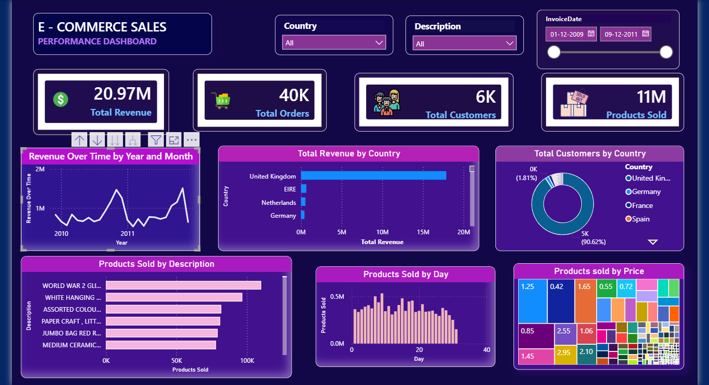

# FUTURE_DS_01: E-Commerce Sales Performance Dashboard

## 📌 Future Interns – Data Science & Analytics Internship

### 🔹 Internship Task Information

| Details          | Information                          |
| ---------------- | ------------------------------------ |
| Internship Track | Data Science & Analytics             |
| Task Number      | Task 1                               |
| Task Name        | Business Sales Performance Analytics |
| Repository Name  | FUTURE_DS_01                         |
| Developed By     | Bani priya                           |
| CIN ID           | FIT/MAY26/DS17907                    |

---

# 🧾 Project Description

This project analyzes **e-commerce business sales data** using Power BI to uncover meaningful insights and performance trends.

The dashboard provides a complete overview of sales performance through interactive visualizations, KPI metrics, and regional analysis.

### Objectives

* Identify revenue trends
* Understand customer purchasing behavior
* Highlight top-selling products
* Analyze high-performing regions
* Detect seasonal sales patterns

---

# 🎯 Project Objectives

✅ Analyze overall sales performance

✅ Identify top revenue-generating countries

✅ Discover best-selling products and categories

✅ Track customer distribution and purchasing trends

✅ Generate actionable business insights

✅ Create a professional and client-ready dashboard

---

# 🛠️ Tools & Technologies Used

| Tool / Technology | Purpose                          |
| ----------------- | -------------------------------- |
| Power BI          | Dashboard Design & Visualization |
| Microsoft Excel   | Data Storage & Handling          |
| Power Query       | Data Cleaning & Transformation   |
| DAX               | KPI Measures & Calculations      |

---

# 📂 Repository Structure

```text
FUTURE_DS_01/
│
├── dashboard/
│   ├── task-1.pbix
│   └── dashboard.png
│
├── dataset/
│   └── data.xlsx
│
├── insights/
│   └── key_insights.md.txt
│
└── README.md
```

---

# 📷 Dashboard Preview



---

# 📈 Dashboard KPIs

| KPI                | Value  |
| ------------------ | ------ |
| 💰 Total Revenue   | 20.97M |
| 🛒 Total Orders    | 40K    |
| 👥 Total Customers | 6K     |
| 📦 Products Sold   | 11M    |

---

# 📊 Dashboard Features

### 🔹 Revenue Over Time

* Consistent growth from 2009–2011
* Seasonal peaks during Q4 (holiday shopping)
* Revenue dips during Q1 (January–February)

### 🔹 Revenue by Country

* UK dominates with 8.2M+ revenue
* Germany and France are secondary markets

### 🔹 Customers by Country

* UK contributes 90%+ of customer base
* Highest repeat purchasing observed in the UK

### 🔹 Products Sold

* WORLD WAR items: 54K+ units sold
* JUMBO BAG series: 47K+ units sold
* Affordable products (£1–£3) drive bulk sales

---

# 💡 Business Recommendations

✅ Run aggressive Q4 holiday campaigns

✅ Stock WORLD WAR & JUMBO BAG products before November

✅ Expand marketing efforts in Germany and France

✅ Introduce bundle offers on top-selling products

✅ Launch a loyalty program for UK customers

✅ Optimize pricing for products in the £1–£3 range

---

# 🧹 Data Cleaning & Transformation

* Removed duplicate records
* Filtered cancelled invoices (prefix "C")
* Removed null Customer IDs
* Filtered negative quantities
* Converted Invoice Date to proper format
* Removed zero and negative unit prices

---

# 📚 Skills Gained

✅ Business Analytics

✅ KPI Analysis

✅ Dashboard Development

✅ Data Cleaning

✅ Power BI Visualization

✅ Insight Generation

✅ Data Transformation

✅ Business Reporting

---

# 🚀 Project Outcome

✔ Delivered a professional interactive dashboard

✔ Generated actionable insights for business growth

✔ Supported data-driven decision-making

✔ Created a portfolio-ready project for internship evaluation

---

# ⚠️ Challenges Faced

* Handling inconsistent data
* Managing large datasets
* Designing effective visualizations
* Balancing dashboard aesthetics with clarity

---

# 📌 Future Improvements

* Predictive sales forecasting
* Customer segmentation analysis
* AI-based recommendation systems
* Real-time dashboard integration

---

# 👨‍💻 Author

Bani priya

🎓 B.Tech in Artificial Intelligence

🏫 Delhi Skill and Entrepreneurship University (DSEU) 

# ⭐ Acknowledgement

This project was completed as part of the **Future Interns – Data Science & Analytics Internship Program**. 

Special thanks to Future Interns for providing practical industry-oriented learning opportunities.
